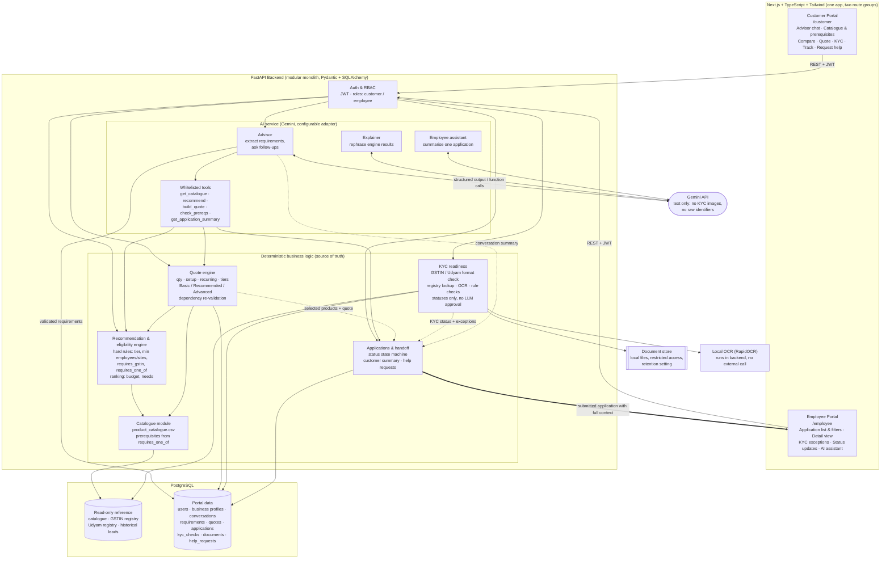

# Airtel SYNC – High-Level Design (HLD)

```mermaid
flowchart TB
    subgraph FE["Next.js + TypeScript + Tailwind (one app, two route groups)"]
        direction LR
        CP["Customer Portal<br/>/customer<br/>Advisor chat · Catalogue & prerequisites<br/>Compare · Quote · KYC · Track · Request help"]
        EP["Employee Portal<br/>/employee<br/>Application list & filters · Detail view<br/>KYC exceptions · Status updates · AI assistant"]
    end

    subgraph BE["FastAPI Backend (modular monolith, Pydantic + SQLAlchemy)"]
        direction TB
        AUTH["Auth & RBAC<br/>JWT · roles: customer / employee"]

        subgraph CORE["Deterministic business logic (source of truth)"]
            direction TB
            CAT["Catalogue module<br/>product_catalogue.csv<br/>prerequisites from requires_one_of"]
            REC["Recommendation & eligibility engine<br/>hard rules: tier, min employees/sites,<br/>requires_gstin, requires_one_of<br/>ranking: budget, needs"]
            QUO["Quote engine<br/>qty · setup · recurring · tiers<br/>Basic / Recommended / Advanced<br/>dependency re-validation"]
            KYC["KYC readiness<br/>GSTIN / Udyam format check<br/>registry lookup · OCR · rule checks<br/>statuses only, no LLM approval"]
            APP["Applications & handoff<br/>status state machine<br/>customer summary · help requests"]
        end

        subgraph AIL["AI service (Gemini, configurable adapter)"]
            direction TB
            ADV["Advisor<br/>extract requirements,<br/>ask follow-ups"]
            EXP["Explainer<br/>rephrase engine results"]
            ESUM["Employee assistant<br/>summarise one application"]
            TOOLS["Whitelisted tools<br/>get_catalogue · recommend ·<br/>build_quote · check_prereqs ·<br/>get_application_summary"]
        end
    end

    subgraph DATA["PostgreSQL"]
        direction LR
        REF[("Read-only reference<br/>catalogue · GSTIN registry<br/>Udyam registry · historical leads")]
        PORT[("Portal data<br/>users · business profiles · conversations<br/>requirements · quotes · applications<br/>kyc_checks · documents · help_requests")]
    end

    FS[["Document store<br/>local files, restricted access,<br/>retention setting"]]
    OCR["Local OCR (RapidOCR)<br/>runs in backend, no external call"]
    GEM(["Gemini API<br/>text only: no KYC images,<br/>no raw identifiers"])

    CP -->|REST + JWT| AUTH
    EP -->|REST + JWT| AUTH
    AUTH --> ADV
    AUTH --> REC
    AUTH --> QUO
    AUTH --> KYC
    AUTH --> APP

    ADV <-->|structured output / function calls| GEM
    EXP <--> GEM
    ESUM <--> GEM
    ADV --> TOOLS
    TOOLS --> REC
    TOOLS --> QUO
    TOOLS --> APP

    REC --> CAT
    QUO --> CAT
    QUO --> REC
    CAT --> REF
    KYC --> REF
    KYC --> OCR
    KYC --> FS
    ADV -->|validated requirements| PORT
    QUO --> PORT
    KYC --> PORT
    APP --> PORT

    QUO -. selected products + quote .-> APP
    KYC -. KYC status + exceptions .-> APP
    ADV -. conversation summary .-> APP
    APP ==>|submitted application with full context| EP
```
