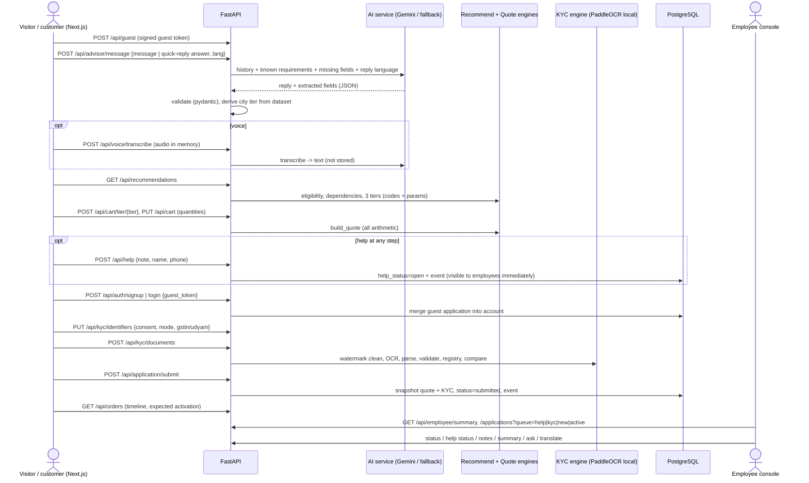

# LLD: Customer flow (guest -> account -> employee)

```mermaid
sequenceDiagram
    actor C as Visitor / customer (Next.js)
    participant API as FastAPI
    participant AI as AI service (Gemini / fallback)
    participant ENG as Recommend + Quote engines
    participant KYC as KYC engine (PaddleOCR local)
    participant DB as PostgreSQL
    actor E as Employee console

    C->>API: POST /api/guest (signed guest token)
    C->>API: POST /api/advisor/message {message | quick-reply answer, lang}
    API->>AI: history + known requirements + missing fields + reply language
    AI-->>API: reply + extracted fields (JSON)
    API->>API: validate (pydantic), derive city tier from dataset
    opt voice
        C->>API: POST /api/voice/transcribe (audio in memory)
        API->>AI: transcribe -> text (not stored)
    end
    C->>API: GET /api/recommendations
    API->>ENG: eligibility, dependencies, 3 tiers (codes + params)
    C->>API: POST /api/cart/tier/{tier}, PUT /api/cart (quantities)
    API->>ENG: build_quote (all arithmetic)
    opt help at any step
        C->>API: POST /api/help {note, name, phone}
        API->>DB: help_status=open + event (visible to employees immediately)
    end
    C->>API: POST /api/auth/signup | login {guest_token}
    API->>DB: merge guest application into account
    C->>API: PUT /api/kyc/identifiers {consent, mode, gstin/udyam}
    C->>API: POST /api/kyc/documents
    API->>KYC: watermark clean, OCR, parse, validate, registry, compare
    C->>API: POST /api/application/submit
    API->>DB: snapshot quote + KYC, status=submitted, event
    C->>API: GET /api/orders (timeline, expected activation)
    E->>API: GET /api/employee/summary, /applications?queue=help|kyc|new|active
    E->>API: status / help status / notes / summary / ask / translate
```
